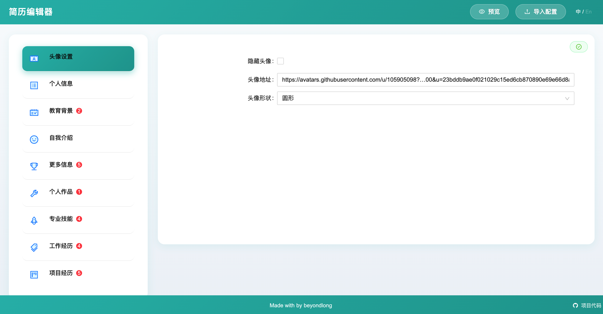
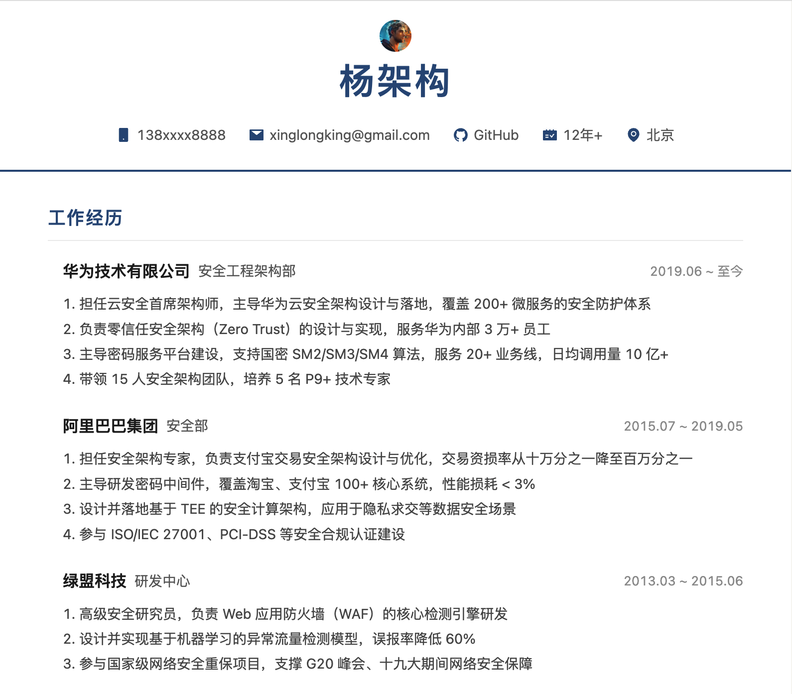
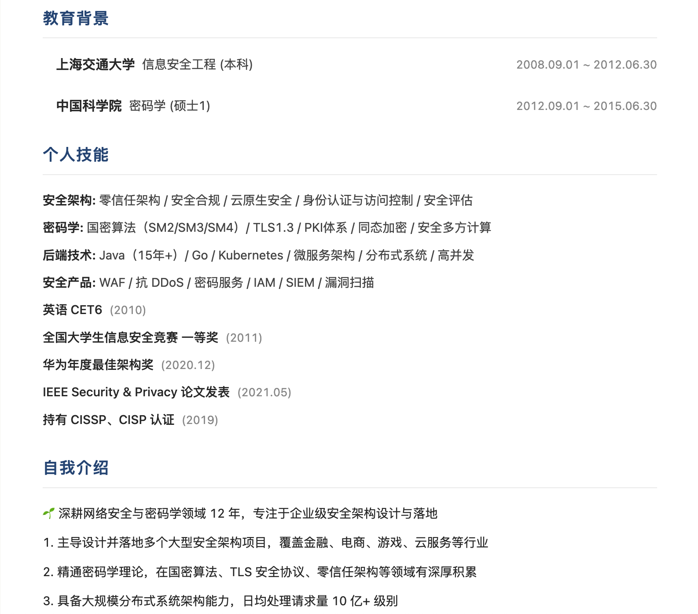
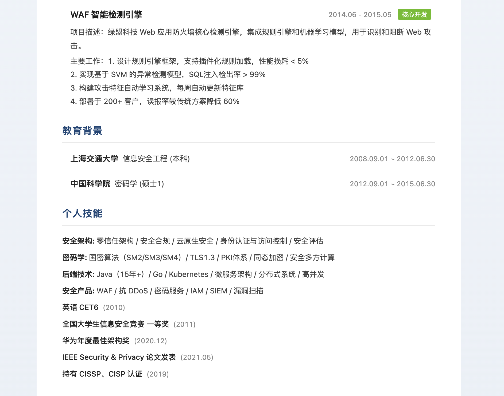

# Resume Builder

[简体中文](./README.md) | English

An online resume editor with 5 templates, config-driven editing, i18n support, AI-assisted resume optimization, JSON export, and browser PDF printing.

[](https://opensource.org/licenses/MIT)
[](https://www.gatsbyjs.com/)
[](https://react.dev/)
[](https://www.typescriptlang.org/)

[Live Demo](https://beyondlong.github.io/resume-builder/) · [Default Template Preview](https://beyondlong.github.io/resume-builder/preview?template=template4)

Quick links: [Core Features](#core-features) · [Quick Start](#quick-start) · [AI Resume Optimization](#ai-resume-optimization) · [AI Career Tools](#ai-career-tools) · [Architecture](#architecture) · [Config-Driven Development](#config-driven-development)



## Table of Contents

- [Highlights](#highlights)
- [Live Demo](#live-demo)
- [Core Features](#core-features)
- [Project Preview](#project-preview)
- [Templates](#templates)
- [Quick Start](#quick-start)
- [AI Resume Optimization](#ai-resume-optimization)
- [AI Career Tools](#ai-career-tools)
- [Tech Stack](#tech-stack)
- [Architecture](#architecture)
- [Project Structure](#project-structure)
- [Config-Driven Development](#config-driven-development)
- [ResumeConfig Shape](#resumeconfig-shape)
- [Recent Cleanup](#recent-cleanup)
- [Known Notes](#known-notes)

## Highlights

- 5 resume templates
- Config-driven forms
- Chinese and English switching
- AI optimization for summary, project, and work description fields
- AI job recommendation and mock interview tools
- Autosave with `localStorage`
- Export JSON configuration
- Print to PDF in the browser

The idea is simple: maintain a `ResumeConfig` through an extensible editor, then render it with different templates for preview, export, and printing.

## Live Demo

- Demo: [Resume Builder](https://beyondlong.github.io/resume-builder/)
- Default preview: [template4](https://beyondlong.github.io/resume-builder/preview?template=template4)

Notes:
- GitHub Pages only hosts the static frontend
- The hosted demo does not automatically include a running AI proxy
- If you want `Improve with AI` in a hosted environment, deploy the AI proxy separately and point `GATSBY_AI_API_BASE_URL` to that service

## Core Features

- 5 templates covering classic, minimal, modern, and business-oriented styles
- Modular editing for avatar, profile, education, work, projects, skills, awards, portfolio, and summary sections
- Add, edit, delete, and drag-sort support for list-based modules
- Theme customization with custom color, preset colors, and reset to default
- AI-assisted resume editing through a separate proxy layer
- AI career tools for role-fit analysis and resume-based mock interview prompts
- Template preview, JSON export, and browser PDF printing

## Project Preview

### Editor

- Left-side module navigation with config-driven forms
- All edits are persisted automatically to browser storage
- Supports AI optimization, theme customization, and drag sorting

### Preview Page

| Preview | Preview | Preview |
| --- | --- | --- |
|  |  |  |

- Switch across 5 templates
- Export JSON configuration
- Print PDF from the browser

## Templates

| Template ID | Name | Description |
| --- | --- | --- |
| `template1` | Classic | Two-column layout with denser information |
| `template2` | Minimal | Lightweight one-page layout |
| `template3` | Multi-page | Clearer section separation |
| `template4` | Modern Minimal | Current default template |
| `template5` | Business | Sidebar layout with a more formal feel |

You can preview templates locally via routes such as:

```text
/preview?template=template4
```

## Quick Start

### Recommended Environment

- Node.js 20
- npm 10

### Install Dependencies

```bash
npm install
```

### Start Frontend Only

```bash
npm start
```

Notes:
- The start script clears `public` and Gatsby development caches first
- It recreates the project `.cache` directory automatically
- This helps reduce stale asset issues in the current Gatsby 2 dev workflow

### Start Frontend and AI Proxy Together

```bash
npm run dev
```

Notes:
- This starts the frontend and AI proxy in parallel
- The frontend still clears Gatsby caches before starting
- Terminal output is prefixed so you can distinguish `start` and `start:ai-proxy`

### Production Build

```bash
npm run build
```

### Deploy to GitHub Pages

```bash
npm run deploy
```

The current Gatsby setup assumes:

- `https://beyondlong.github.io/resume-builder/`
- `pathPrefix: /resume-builder`

If you change the repository name or deployment path, update `pathPrefix` in [gatsby-config.js](/Users/yangxinglong/zayne/resume-builder/gatsby-config.js) as well.

## AI Resume Optimization

AI optimization runs through a separate proxy service so provider tokens are never exposed in the browser.

### Supported Fields

- Summary / self-introduction
- Project description
- Project responsibilities / major work
- Work description

### Proxy Mode

- The frontend sends requests to `/api/ai/improve`
- The proxy selects a provider and forwards the request
- Supported providers:
  - `dashscope`
  - `openai-compatible`

### Configuration

1. Copy the environment template

```bash
cp .env.example .env
```

2. Configure a provider

DashScope example:

```env
AI_PROVIDER=dashscope
AI_MODEL=qwen-plus
DASHSCOPE_API_KEY=your_dashscope_api_key
DASHSCOPE_BASE_URL=https://dashscope.aliyuncs.com/api/v1
```

OpenAI-compatible example:

```env
AI_PROVIDER=openai-compatible
AI_MODEL=gpt-4o-mini
OPENAI_COMPATIBLE_API_KEY=your_token
OPENAI_COMPATIBLE_BASE_URL=https://example.com/v1
OPENAI_COMPATIBLE_MODEL=gpt-4o-mini
```

3. Start the AI proxy

```bash
npm run start:ai-proxy
```

Default port:
- `http://localhost:8787`

During local development, the `Improve with AI` button will call the proxy automatically:
- local development defaults to `http://localhost:8787/api/ai/improve`
- if `GATSBY_AI_API_BASE_URL` is set, it will be used first

### Common Messages

- `AI service is unavailable. Please make sure the proxy server is running.`
  The proxy is not running or the frontend cannot reach it.
- `AI service is not configured. Please check environment variables.`
  The proxy is running, but the provider or token configuration is missing.

## AI Career Tools

In addition to field-level `Improve with AI`, the project now includes two AI tools that analyze the current resume as a whole.

### AI Job Recommendation

- Entry point: tool area in the editor page
- Uses the current `ResumeConfig` instead of a single field
- Current output includes:
  - role direction
  - fit score
  - recommended industries
  - company types
  - matching tech tags
  - fit reasons
  - resume improvement suggestions

This is useful when you want to understand which kinds of roles your current resume fits best before continuing to edit it.

### AI Mock Interview

- Entry point: top action area on the preview page
- Questions are generated from the current resume content, not from a generic question bank
- Current output includes:
  - interview questions
  - interviewer intent
  - answer guidance
  - resume evidence when available

This is useful after the resume is mostly complete and you want to rehearse project, experience, and skill-based interview questions.

### Runtime Notes

Both tools reuse the same AI proxy service as `Improve with AI`:

- use `npm run dev` for local development
- GitHub Pages hosts only the frontend
- if you want these features in a hosted demo, deploy the AI proxy separately and point `GATSBY_AI_API_BASE_URL` to it

## Tech Stack

- Gatsby 2
- React 17
- TypeScript
- Ant Design 4
- Less
- react-intl
- react-dnd
- Node.js AI proxy

## Architecture

The active editor chain is:

`src/pages/index.tsx -> src/contexts/ResumeConfigContext.tsx -> src/components/ResumeEditor/*`

The preview chain is:

`src/pages/preview.tsx -> src/components/Resume/*`

The AI chain is:

`FormCreator -> src/services/ai/client.ts -> /api/ai/improve -> provider adapter`

You can think of the project as a four-step flow:

1. The editor page manages a `ResumeConfig`
2. Changes are written to browser storage
3. The preview page renders the config with a selected template
4. The AI proxy enhances editing without exposing provider credentials

## Project Structure

```text
src/
├── components/
│   ├── Avatar/                  # Avatar component
│   ├── FormCreator/             # Config-driven forms + AI entry points
│   ├── Resume/                  # Template rendering layer
│   │   ├── Template1/
│   │   ├── Template2/
│   │   ├── Template3/
│   │   ├── Template4/
│   │   ├── Template5/
│   │   ├── shared.ts
│   │   ├── shared-sections.tsx
│   │   └── shared-layouts.tsx
│   ├── ResumeEditor/            # Main editor UI
│   └── types.ts                 # ResumeConfig / ThemeConfig
├── config/
│   ├── resume-fields.tsx
│   ├── resume-modules.tsx
│   └── types.ts
├── contexts/
│   └── ResumeConfigContext.tsx
├── data/
│   ├── constant.ts
│   └── resume.ts
├── helpers/
│   ├── resume-config.ts
│   ├── resume-dates.ts
│   ├── resume-ai.ts
│   └── storage.ts
├── i18n/
├── pages/
│   ├── index.tsx
│   ├── preview.tsx
│   └── 404.tsx
└── services/
    └── ai/

server/
├── routes/
├── providers/
└── utils/
```

## Config-Driven Development

The editor is configuration-driven rather than hardcoded:

- [src/config/resume-modules.tsx](/Users/yangxinglong/zayne/resume-builder/src/config/resume-modules.tsx) defines which modules appear in the left panel
- [src/config/resume-fields.tsx](/Users/yangxinglong/zayne/resume-builder/src/config/resume-fields.tsx) defines which fields appear in the editor form
- [src/components/types.ts](/Users/yangxinglong/zayne/resume-builder/src/components/types.ts) defines the actual data model

To add a new module, you will usually touch:

1. `src/components/types.ts`
2. `src/config/resume-modules.tsx`
3. `src/config/resume-fields.tsx`
4. `src/data/resume.ts`
5. The target template rendering files

## ResumeConfig Shape

The core data model is `ResumeConfig`, mainly including:

- `avatar`
- `profile`
- `educationList`
- `workExpList`
- `projectList`
- `skillList`
- `awardList`
- `workList`
- `aboutme`
- `titleNameMap`
- `theme`

Default data lives in:

- [src/data/resume.ts](/Users/yangxinglong/zayne/resume-builder/src/data/resume.ts)
- [static/resume.json](/Users/yangxinglong/zayne/resume-builder/static/resume.json)

## Recent Cleanup

The repository has already gone through these improvements:

- Removed the old editor chain and kept only `index.tsx + ResumeEditor + Context`
- Split the old `contant.tsx` into `src/config`
- Extracted shared config-loading helpers
- Switched the context layer to reducer-based updates
- Unified date normalization and formatting
- Extracted shared template view model / section / layout helpers
- Added theme customization
- Added an AI proxy layer with provider adapters
- Stabilized Gatsby 2 dependencies, Less config, and dev startup scripts

## Known Notes

- Gatsby 2 + React 17 + legacy plugins still produce some historical warnings
- `npm run build` currently passes
- After dependency or page-structure changes, restarting `npm start` is recommended
- GitHub Pages can only host the static frontend; the AI proxy must be deployed separately

## License

MIT
