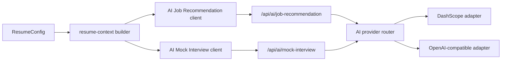

# AI Career Tools Design

Date: 2026-04-03
Project: `resume-builder`
Status: Draft for review

## Summary

This document defines the first-phase design for two new AI features:

1. `AI Job Recommendation`
2. `AI Mock Interview`

Both features build on the existing AI proxy architecture and reuse the current `ResumeConfig` data model. The first phase focuses on structured, resume-based analysis rather than real-time job crawling, JD matching, or multi-turn interview conversations.

The goal is to extend the product from “resume editing + template preview” into “resume editing + career guidance + interview preparation” without disrupting the current editing and preview flows.

## Goals

- Add `AI Job Recommendation` to the editor page
- Add `AI Mock Interview` to the preview page
- Reuse the existing AI proxy and provider adapter architecture
- Base both features on the current resume content rather than generic prompts
- Return structured JSON responses that are safe and predictable for UI rendering
- Keep first-phase UI and architecture lightweight enough to fit the current Gatsby 2 codebase

## Non-Goals

The first phase does not include:

- Real-time job crawling
- Matching against external job descriptions
- Recommending concrete company names
- Multi-turn mock interview conversations
- User answer evaluation or follow-up questioning
- AI-generated resume rewrites outside the existing field-level optimization flow

## Product Placement

### AI Job Recommendation

Location:
- Editor page

Reasoning:
- This feature helps users understand what kinds of roles their current resume is suitable for
- It belongs closer to the editing workflow, where users can act on the recommendations and improve the resume immediately

Interaction:
- Add an `AI岗位推荐` button to the editor page tool area
- Open a drawer instead of navigating to a new page
- Show loading, error, and structured recommendation cards inside the drawer

### AI Mock Interview

Location:
- Preview page

Reasoning:
- This feature is closer to interview preparation than editing
- Preview mode already represents the “ready to deliver” state of the resume
- Users will naturally want to practice interview questions after previewing the final resume

Interaction:
- Add an `AI模拟面试` button to the preview page tool area
- Open a drawer instead of navigating to a new page
- Show a generated interview set based on the current resume

## Core Principles

### Resume-Based, Not Generic

Both features must be based on the current `ResumeConfig` content.

- `AI Job Recommendation` should infer role direction, industry direction, company type, and skill fit from the actual resume
- `AI Mock Interview` should generate questions that directly reflect the candidate’s projects, work history, summary, and skills

The system should avoid producing generic content that ignores the current resume.

### Structured Outputs

All AI routes should return strict JSON structures.

Benefits:
- easier UI rendering
- easier testing
- lower risk of prompt drift breaking the frontend
- consistent cross-provider behavior

### Shared Resume Context

Both features depend on a shared “resume analysis context” derived from `ResumeConfig`.

Instead of sending the full raw config object directly to the model, the frontend should first normalize the resume into a compact structured summary that emphasizes:

- profile and summary
- education highlights
- work history highlights
- project highlights
- skill tags
- experience patterns

This reduces token waste and gives the model clearer guidance.

## High-Level Architecture



## Frontend Design

### Shared Resume Context Builder

New frontend helper:

- `src/services/ai/resume-context.ts`

Responsibilities:
- read current `ResumeConfig`
- normalize useful data for AI
- remove low-signal structure noise
- produce a reusable summary payload for both tools

Suggested output shape:

```ts
type ResumeAIContext = {
  language: 'zh-CN' | 'en-US';
  profile: {
    name?: string;
    city?: string;
    yearsOfExperienceHint?: string;
    currentTitle?: string;
  };
  summary?: string;
  education: Array<{
    school?: string;
    major?: string;
    degree?: string;
    time?: string;
  }>;
  workExperience: Array<{
    company?: string;
    role?: string;
    time?: string;
    description?: string;
  }>;
  projects: Array<{
    name?: string;
    description?: string;
    responsibilities?: string;
    techHints?: string[];
  }>;
  skills: string[];
};
```

This helper will be shared across:
- existing field-level AI improvements in the future if needed
- `AI Job Recommendation`
- `AI Mock Interview`

### AI Job Recommendation UI

New components:

- `src/components/AIJobRecommendation/index.tsx`
- `src/components/AIJobRecommendation/RecommendationDrawer.tsx`
- `src/components/AIJobRecommendation/RecommendationCard.tsx`

Entry point:
- editor page tool area

Flow:
1. user clicks `AI岗位推荐`
2. build `ResumeAIContext`
3. request `/api/ai/job-recommendation`
4. render summary + recommendation cards

Displayed content:
- overall summary
- 3 recommended role cards

Each role card contains:
- role title
- fit score
- recommended industries
- recommended company types
- matching tech tags
- recommendation reasons
- resume improvement suggestions

### AI Mock Interview UI

New components:

- `src/components/AIMockInterview/index.tsx`
- `src/components/AIMockInterview/InterviewDrawer.tsx`
- `src/components/AIMockInterview/InterviewQuestionCard.tsx`

Entry point:
- preview page tool area

Flow:
1. user clicks `AI模拟面试`
2. build `ResumeAIContext`
3. request `/api/ai/mock-interview`
4. render interview summary + question list

Displayed content:
- one overall summary
- 6 interview questions by default

Each question card contains:
- question
- interview intent
- answer guidance
- optional resume evidence

## API Design

The new features should not reuse `/api/ai/improve`.

New routes:

- `POST /api/ai/job-recommendation`
- `POST /api/ai/mock-interview`

Reasoning:
- these features are full-resume analysis tools, not field-level text optimization
- they need distinct prompts and response schemas
- keeping them separate reduces ambiguity and simplifies testing

### Job Recommendation Request

```json
{
  "resume": {},
  "language": "zh-CN"
}
```

### Job Recommendation Response

```json
{
  "summary": "这份简历整体更适合企业服务、中后台系统和平台建设相关岗位。",
  "roles": [
    {
      "title": "中后台前端工程师",
      "score": 88,
      "industries": ["企业服务", "SaaS", "金融科技"],
      "companyTypes": ["ToB 产品公司", "中型研发团队", "平台型业务团队"],
      "techTags": ["React", "TypeScript", "后台系统", "组件化", "工程化"],
      "reasons": [
        "有较多后台系统和管理平台经验",
        "项目内容更贴近企业级应用"
      ],
      "suggestions": [
        "补充项目结果指标",
        "强化工程化和性能优化表达"
      ]
    }
  ]
}
```

### Mock Interview Request

```json
{
  "resume": {},
  "language": "zh-CN"
}
```

### Mock Interview Response

```json
{
  "summary": "这组题目会重点围绕你的项目经历、职责深度和技术能力展开。",
  "questions": [
    {
      "question": "请介绍一下你在企业后台系统建设中的核心职责。",
      "intent": "考察候选人在项目中的真实承担与交付深度。",
      "answerGuidance": [
        "先说明项目背景和你的角色",
        "再讲核心模块和你的具体负责范围",
        "最后补充结果和难点"
      ],
      "resumeEvidence": "5年前端开发经验，负责企业后台系统建设"
    }
  ]
}
```

## Server Design

New files:

- `server/routes/job-recommendation.js`
- `server/routes/mock-interview.js`

Likely shared helpers:

- `server/prompts/job-recommendation.js`
- `server/prompts/mock-interview.js`
- `server/utils/ai-json.js` if needed later

Responsibilities:

- validate request shape
- build tool-specific prompt
- call existing provider router
- normalize structured result
- return detailed upstream errors when providers fail

The existing provider adapters remain reusable:
- `dashscope`
- `openai-compatible`

## Prompt Strategy

### Job Recommendation Prompt

Position the model as:
- senior HR expert
- technical recruiter
- resume screening assistant

Required behavior:
- infer suitable role directions from the resume
- recommend industries and company types
- identify technical fit signals
- provide realistic, non-generic improvement suggestions
- avoid naming concrete companies in the first phase

### Mock Interview Prompt

Position the model as:
- senior interviewer
- technical hiring manager

Required behavior:
- generate questions strictly based on the resume content
- prioritize project and work experience
- avoid generic interview question dumps
- explain why each question matters
- provide practical answer guidance

Suggested first-phase question mix:
- 1 summary question
- 3 project/work deep-dive questions
- 2 skill or technical questions

## Error Handling

Both tools should reuse the current AI error behavior, with tool-specific messaging layered on top if needed.

Error categories:
- proxy unavailable
- provider not configured
- upstream provider failed
- invalid AI response
- bad request

UI behavior:
- drawer opens
- loading state is visible
- on failure, display clear message inside drawer instead of silent failure

## Testing Strategy

### Frontend

Add tests for:
- resume context builder
- job recommendation service client
- mock interview service client
- editor entry button / drawer behavior
- preview entry button / drawer behavior

### Server

Add tests for:
- request validation
- normalized response parsing
- upstream failure propagation
- prompt route success path

### Integration-Level Verification

Manual verification:
- local DashScope flow
- local OpenAI-compatible flow
- invalid provider config
- proxy-down state

## Implementation Order

Recommended order:

1. add shared `resume-context` builder
2. implement `AI Job Recommendation` route and client
3. build editor-side recommendation drawer
4. implement `AI Mock Interview` route and client
5. build preview-side interview drawer
6. add tests, docs, and i18n strings

This order reduces duplication because both tools share the same resume normalization layer.

## Risks

### Risk: overly generic AI output

Mitigation:
- enforce resume-based prompts
- use structured response schema
- include field-specific and context-specific prompt rules

### Risk: model hallucination in role suggestions

Mitigation:
- recommend role direction / industry / company type rather than concrete companies
- explicitly instruct the model to avoid unsupported claims

### Risk: drawer UI becomes overcrowded

Mitigation:
- keep first phase read-only
- use summary + cards layout
- defer advanced actions until later phases

## Later Extensions

Possible future upgrades:

- JD-based recommendation scoring
- company name suggestions with online validation
- answer-by-answer mock interview feedback
- multi-turn follow-up questioning
- saved interview sessions
- AI-generated “targeted resume version” based on role recommendation

## Decision

The first phase will introduce:

- `AI岗位推荐` as an editor-side drawer
- `AI模拟面试` as a preview-side drawer
- shared resume analysis context
- two dedicated AI routes
- structured JSON responses
- no job crawling, no concrete company recommendation, no multi-turn interview
